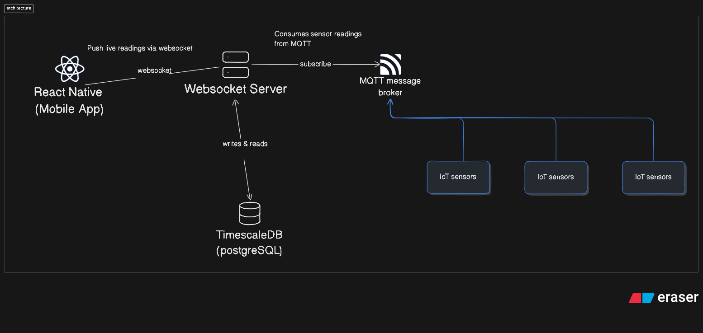

# AeroSafe

## Architecture
What we will be building is a **_simulation_** of a large amount of data constantly coming in from IoT sensors to an MQTT Broker. We will have a backend service that acts as both a websocket server and an API to allow the mobile app to poll for near real-time updates and live alerts.

## Tech Stack
- React-Native
- Go
- PostgreSQL (TimescaleDB + PostGIS)
- Mapbox
